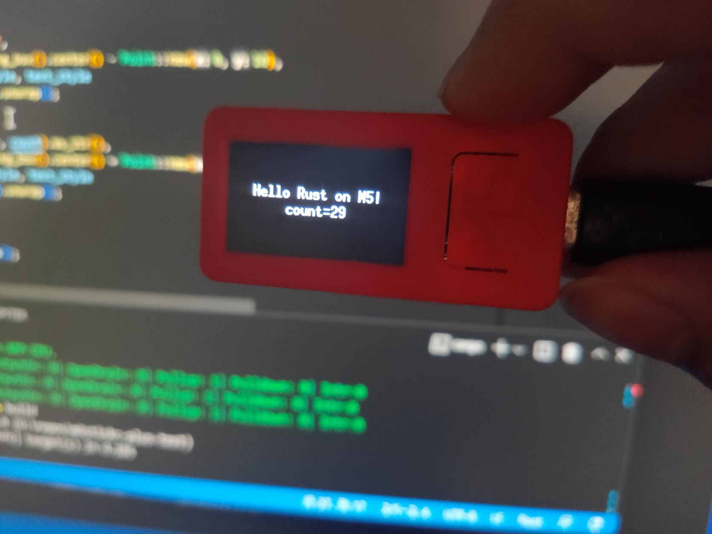

# rust-m5stickc-plus-test
Example of running Rust on M5StickC Plus.

## License
MIT or Apache-2.0.

Note: this repository contains a file (`src/axp192.rs`) translated from [M5StickC-Plus Arduino library](https://github.com/m5stack/M5StickC-Plus), which is released under MIT license.